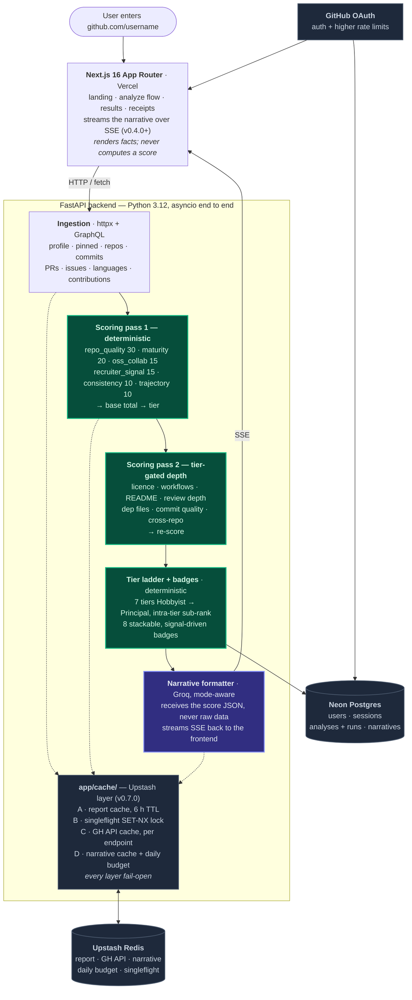

# Architecture

> System design for **Skill Issue**. Living document — update on every structural change. Companion to [`PLAN.md`](./PLAN.md) and [`docs/TECH_STACK.md`](./docs/TECH_STACK.md).

---

## Guiding principles

1. **Determinism before AI.** Every score is computed by code, not by an LLM. The LLM only writes prose around already-computed numbers.
2. **Stateless analyzers, cached results.** Scoring is a pure function of GitHub data. Caching lives at the edges (Redis + Postgres), not inside the scorers.
3. **Polite to GitHub.** Respect rate limits, prefer authenticated requests, use GraphQL when it saves N+1 round-trips, cache aggressively.
4. **Frontend renders facts.** The frontend never computes a score; it consumes a fully-formed report from the backend.
5. **MCP and plugins are the toolbox, not the product.** They accelerate development but are never load-bearing for users.

---

## High-level data flow

Green nodes are guiding principle 1 in the diagram: pure functions of GitHub data, no I/O, no model. The single blue node is the only place an LLM runs, and it is downstream of every number it will describe.

---

## Component breakdown

### Frontend — `frontend/` (Next.js 16)

- **App Router** for layouts, streaming, and partial prerendering. Bundler: **Turbopack** (Next 16 default).
- **Server Components** for the landing and shell; **Client Components** only where interactivity (mode toggle, animations, position-bar marker, badge tooltips) requires it.
- **shadcn/ui** as the component baseline; **Base UI** primitives (Progress, Tooltip) for accessible composition; **Framer Motion** with `LazyMotion` (`m` namespace) for orchestrated transitions.
- **Routes:**
  - `/` — landing
  - `/u/[username]` — results (tier ladder, position bar, badges, score matrix)
  - `/u/[username]/card` — shareable OG card preview page with Copy/Download/Copy-URL actions (v0.6.0)
  - `/u/[username]/opengraph-image` + `/u/[username]/twitter-image` — auto-wired 1200×630 PNGs via Next 16 file conventions (v0.6.0)
  - `/share/[slug]` — public read-only view (v0.8.6: **Partial Prerender via Cache Components**, `share:<slug>` tag) + matching OG/Twitter image routes (same tag)
  - `/me` — authenticated history (v0.5.0+) with `<RefreshButton>` per row (v0.8.2)
  - `/api/revalidate` — server-to-server webhook (v0.8.6) that the backend's share-toggle endpoints hit to bust the per-slug ISR tag. Constant-time secret check + tag regex
- **Caching strategy:** `cacheComponents: true` in `next.config.ts`. `/share/[slug]` uses `'use cache'` + `cacheTag('share:<slug>')` + `cacheLife({ revalidate: 3600 })` on the data fetch; the page wraps it in `<Suspense>` so the static shell prerenders cleanly. **Trade-off:** PPR static shell ships HTTP 200 even when the dynamic body calls `notFound()` — browser UX renders the not-found page correctly; programmatic clients see 200. Backend `/share/<unknown>` still returns clean 404.
- **State:** server-driven by default; `useSyncExternalStore` for the localStorage-backed `useSession()` and mode-preference hooks (avoids React 19's `react-hooks/set-state-in-effect` rule).
- **Tests:** Vitest 4 + happy-dom 20 + Testing Library (added in v0.6.0). **66** frontend tests cover the OG palette, data fetchers, OgCard, CardActions, events wiring, PostHog provider, FramerProvider, the v0.8.2 `<RefreshButton>` state machine, and the v0.8.6 `/api/revalidate` route. `next/cache` (`cacheTag` / `cacheLife` / `revalidateTag`) is stubbed once in `src/test/setup.ts` since those helpers throw outside the Next runtime when `cacheComponents` is enabled.

### Backend — `backend/` (FastAPI)

- **Layers:** `app/ingestion/`, `app/scoring/` (which contains `tiers.py`, `badges.py`, `depth.py`, `engine.py` + per-bucket scorers), `app/github/`, `app/narrative/` (v0.4.0), `app/db/` + `app/auth/` + `app/persistence/` (v0.5.0), `app/cache/` (v0.7.0), `app/cron/` (v0.8.1), `app/share/` (v0.8.6 — `webhook.py` POSTs to the frontend `/api/revalidate` on every share toggle).
- **Concurrency:** `asyncio` end to end; `httpx.AsyncClient` for outbound; no blocking I/O in the request path.
- **GitHub access:** REST + GraphQL via a single typed client that handles rate-limit headers, retries with jitter, and conditional requests (`If-None-Match`).
- **Scoring contract:** every scorer is `def score(profile: Profile) -> ScoreResult` where `ScoreResult` carries `points: int`, `max_points: int`, and `evidence: list[Evidence]`. Evidence is what the UI displays under "Why this score" — never hand-waved.
- **Tier contract:** `assign_tier(total: int) -> TierInfo` returns `(name, sub_rank, band, prev_tier, next_tier, pts_to_next, pts_above_prev)`. Pure function of the integer total; no I/O.
- **Badge contract:** each detector is `(profile, breakdown) -> Badge | None`. Detectors compose via `compute_badges(profile, breakdown) -> list[Badge]`. Badges stack — no priority ordering.
- **Depth contract:** `enrich_for_tier(profile, base_tier, gh) -> None` mutates the profile with deeper signals appropriate to the base tier. All extra HTTP calls funnel through here and fan out via `asyncio.gather`. Per-call failures are swallowed; the base report is still valid.
- **Narrative contract:** narrative functions receive *only* the `Report` (scores + tier + badges + headline signals). They cannot see raw repos or commits. This prevents the LLM from inventing technical claims.

### Data — Neon Postgres

Schema sketch (finalized in v0.5.0):

- `users(id, github_id, login, avatar_url, created_at)`
- `analyses(id, user_id?, username, created_at, latest_run_id)`
- `analysis_runs(id, analysis_id, score_json, tier, sub_rank, badges_json, started_at, finished_at, github_etag)`
- `narratives(id, run_id, mode, text, model, cost_cents)`
- `share_tokens(id, analysis_id, token, expires_at)`

### Cache — Upstash Redis (v0.7.0)

Four fail-open layers; every operation swallows Redis exceptions and falls through to the live path. The cache is never a correctness boundary.

| Layer | Key | TTL | Purpose |
| --- | --- | --- | --- |
| **A. Report** | `si:v1:report:<lowercased-username>` | 6h | Full scored `Report` JSON. Warm `/analyze/{user}` p95 ≤ 200ms. |
| **B. Singleflight lock** | `si:v1:lock:report:<lowercased-username>` | 60s | `SET NX` lock around cold-cache ingest; waiters poll every 200ms for up to 25s. Release is **holder-checked** (compare-and-delete) so a slow holder can't delete a successor's lock (v1.0.5). |
| **C. GitHub API responses** | `si:v1:gh:<METHOD>:<sha256(url+params+body)>` | per-endpoint (commits 5m, repos 15m, profile/languages 1h, contents 30m, GraphQL 15m) | Per-request caching to stretch the 5000/hr GH rate-limit budget. Only 200/404/422 cached; 429/5xx fall through. |
| **D. Narrative + daily budget** | `si:v1:narrative:<username>:<scores_hash>:<mode>` (24h) + `si:v1:budget:narrative:<UTC-day>` (25h) | varies | Shared narrative cache and shared `INCR`-based daily counter — works correctly across Fluid Compute instances. |

Bumping `KEY_PREFIX` in `app/cache/client.py` invalidates every namespace at once.

### Reliability & abuse controls (v0.9.2 → v1.0.8)

A layered defense against a single caller (or a Redis outage) exhausting the shared GitHub token, the worker pool, or the LLM budget. Built from the 2026-07-24 security audit.

- **Rate limiting (`app/ratelimit.py`, v0.9.2+).** Per-hour caps on `/analyze` + `/narrative`: anonymous callers per-IP, signed-in per-user. The client IP is taken from Vercel's spoof-proof `x-forwarded-for` (v1.0.4 SI-04); the RSC proxy forwards `x-client-ip` behind a constant-time `x-internal-secret`. When that secret is unset, anonymous `/analyze` falls back to a conservative shared backstop rather than skipping (v1.0.4 SI-05).
- **LLM budget (`app/narrative/budget.py`, v1.0.4).** A global daily ceiling **plus** per-IP and per-user daily caps, so one caller can't drain the day's AI generation. A budget slot is refunded when a client aborts the SSE stream mid-generation (v1.0.5 SI-07).
- **Fail-closed cost controls (v1.0.4 SI-01).** When Redis is unreachable, the rate limiter and LLM budget degrade to a conservative **in-process** limiter instead of failing open.
- **Ingest amplification containment (v1.0.5).** A per-analysis hard cap on live GitHub calls (`GitHubClient` counts them; ~150 vs. a ~98 legit worst case) → 503; a capped `Retry-After` sleep + HTTP-date-safe parse + `429` handling; and a wall-clock ingest deadline (`_live_ingest_bounded`) → 503.
- **Shared-token quota breaker (v1.0.6).** `GitHubClient` observes `X-RateLimit-Remaining` on live shared-token responses (only when it dips below a watch threshold) and writes a low-water mark to Redis; `_live_ingest` sheds **new anonymous** analyses (503 `service_busy`) before the shared token is exhausted. Signed-in users bypass.
- **CORS boot guard (v1.0.7 SI-14).** A credentialed wildcard origin (`CORS_ALLOW_ORIGINS=*`) is refused at startup.
- **Hashed session ids at rest (v1.0.8 SI-21).** Session ids are stored `sha256`-hashed, so a database-only compromise can't be replayed to hijack a live session. No migration was needed — the `id` column stays `Text`; pre-existing raw-id rows simply miss the hashed lookup, yielding a clean re-login, and are reaped by the expiry cron.
- **Origin check on mutations (v1.0.8 SI-16).** `require_trusted_origin` rejects state-changing requests (`/analyses` share/unshare/delete, `/me/refresh`) from an untrusted `Origin` with a 403 `bad_origin`. An absent Origin passes, so server-side and `curl` callers still work; this is defense-in-depth layered on top of ownership checks and SameSite cookies.

All of these are fail-open/degrade-gracefully where availability matters and fail-closed where cost/abuse matters; every threshold is an env-tunable `Settings` field with a safe default.

### CI integrity (v1.0.9 → v1.0.10)

Two guards protecting the gates themselves, both born from the same failure mode: a check that reports the wrong thing for the wrong reason.

- **Audit-gate resilience (`backend/tools/audit_gate.py`, v1.0.9).** Both `npm audit` and `pip-audit` exit `1` for a registry outage *and* for a real advisory, so gating on the exit code made an outage a repo-wide hard blocker. The gate classifies on **parsed output shape** instead, across four verdicts — `CLEAN`, `FINDINGS`, `SERVICE_UNAVAILABLE` (retry ×3, then warn and pass), and `ERROR`. Only positively-identified transport failures are forgiven; anything unexplained returns `ERROR` and still fails, so "pass on outage" can't decay into "pass on anything we don't understand".
- **Dependency-manifest drift guard (v1.0.10).** `backend/requirements.txt` is generated by `uv export`, so hand-editing a pinned line bypasses the resolver that makes those pins coherent. CI now asserts both links of `pyproject.toml → uv.lock → requirements.txt`: `uv lock --check` for the first, and regenerate-in-place plus `git diff --exit-code` for the second.

### Observability — Sentry + PostHog + structlog (v0.8.0)

Two thin cross-cutting layers. Both fail open — telemetry is never a correctness boundary.

- **Backend `app/observability/`** — `structlog` JSON logging (console renderer in dev) with a `request_id` contextvar bound by `RequestIDMiddleware` (UUID4 per request). Sentry FastAPI integration captures unhandled exceptions; a `before_send` PII scrub hook strips `access_token`, `access_token_ct`, `oauth_state`, `oauth_code`, `session_id`, full `Cookie`/`Authorization`/`X-Internal-Secret`/`X-Revalidate-Secret`/`X-Client-IP`/`X-Forwarded-For`/`X-Real-IP` headers, and `email` before the envelope leaves the process (v1.0.4 SI-11 added the internal-secret + visitor-IP headers). `request_id` is tagged on every Sentry event and echoed in the `X-Request-ID` response header so frontend breadcrumbs can correlate.
- **Frontend `src/observability/`** — Sentry browser SDK via Next 16's `instrumentation.ts`. Source-map upload is deferred to a v0.8.x patch (requires `SENTRY_AUTH_TOKEN` + `SENTRY_ORG` + `SENTRY_PROJECT` provisioning); runtime capture works without it but stack traces stay minified until the wrapper is re-added. PostHog browser SDK wraps the layout via `<ObservabilityProvider>` — auto-pageviews + web-vitals capture + named events (`analyze_submitted`, `share_toggled`, `share_card_copied`, `mode_toggled`, `sign_in_clicked`). Signed-in users identified by the opaque `si_session` cookie value (never GitHub login, never email); anonymous viewers use PostHog's auto-distinct ID.
- **Correlation contract:** one `request_id` per request flows through middleware → structlog → Sentry tag → response header. One canonical session ID across PostHog `identify()` and Sentry `user.id`.
- **Real-user perf metrics:** PostHog `enable_web_vitals_autocapture` captures LCP / CLS / INP per visitor with element selectors — closes v0.7.2's "couldn't identify the prod LCP element" gap without adding a second vendor.

### Auth — GitHub OAuth (v0.5.0)

- Server-side OAuth code flow (no PKCE — GitHub OAuth Apps don't support it). State in a short-lived httpOnly cookie.
- We request `read:user` only (tightened in v0.9.5). We exclusively read public data, which needs no repo scope; `public_repo` was dropped because — despite its name — it grants *write* access to public repos and needlessly widened a leaked token's blast radius. Never `repo`, never `admin:*`.
- Token storage: **server-side opaque session** cookie (`secrets.token_urlsafe(32)`); the GitHub access token is **AES-GCM encrypted at rest** in the `sessions` row with a per-environment `SESSION_TOKEN_ENC_KEY`.
- Signed-in `/analyze` uses the user's GitHub token for ingestion, giving each user a dedicated 5000/hr rate-limit budget.

### AI — Groq (OpenAI-compatible)

- Client wrapped behind `narrative/llm.py` so swapping providers is a single-file change. Accepts `base_url` for any OpenAI-compatible endpoint.
- Production model: **Groq `openai/gpt-oss-120b`** (free tier: 30 RPM / 1K RPD / 8K TPM / 200K TPD, 131k context). Configured via `NARRATIVE_BASE_URL=https://api.groq.com/openai/v1` + `NARRATIVE_MODEL=openai/gpt-oss-120b`. Groq decommissioned the previous default, `llama-3.3-70b-versatile`, on 2026-08-16.
- Reasoning tokens land in a separate `reasoning` field on gpt-oss, not in `message.content`, so the SSE pipeline reads `delta.content` and stays free of `<think>` output with no extra parsing.
- Strict prompt templates per mode; all prompts version-controlled, regression-tested via committed snapshots in `tests/narrative/test_prompt_snapshots.py`.
- Cost guardrails: per-request `max_tokens` cap, daily request budget (`NARRATIVE_DAILY_LIMIT`, code default 500, **set to 55 in production** to stay inside Groq's 200K token/day free-tier ceiling at ~3.2K tokens/call, **shared across instances via Upstash since v0.7.0**), deterministic on-voice fallback narrative when the budget is exhausted (`[AI narrator offline — daily cap reached]`) or upstream errors (`[AI narrator offline — upstream hiccup]`).

---

## MCP and plugin ecosystem (development tooling)

These are **development-time accelerators**, not runtime dependencies. None of them ship to users.

| MCP / Plugin | Role | When to use |
| --- | --- | --- |
| **GitHub MCP** | Repository intelligence | Anywhere we'd otherwise hand-call `gh` — PRs, issues, repo inspection during dev |
| **Context7** | Live framework docs | Before guessing Next.js / React / FastAPI / shadcn API usage |
| **Playwright MCP** | UI automation | Visual verification of frontend changes; OG card render checks |
| **Postgres MCP** | DB intelligence | Schema inspection, query plans during scoring tuning |
| **Figma MCP** | Design ↔ code sync | When importing layout / typography / spacing from design files |
| **Sequential Thinking MCP** | Structured reasoning | Large architectural decisions, scorer design |
| **Vercel plugin (`vercel:*` skills)** | Deploy + env + storage | Anything Vercel-side: deploys, env pulls, marketplace, OG, runtime cache |
| **shadcn skill** | Component install / theming | Adding or composing shadcn primitives |
| **Filesystem MCP** | Bulk edits | Cross-file refactors, structural moves |

> **Rule:** New MCPs and plugins require user approval before install. See rule 5 in [`AGENTS.md`](./AGENTS.md).

---

## Deployment topology (current)

- **Single Vercel project** hosts both frontend and backend via `experimentalServices` in the root `vercel.ts` (locked 2026-05-18; migrated from `vercel.json` to typed config in v0.8.7). Frontend serves at `/`; backend mounted at `/_/backend/*`.
- **Compute:** Vercel Functions (Fluid Compute) — function instances reused across concurrent requests, ~300s default timeout, OIDC env handoff.
- **DB:** Neon Postgres via the Vercel Marketplace integration (auto-injects `DATABASE_URL` + variants). URL normaliser in `app/db/engine.py` strips libpq-only query params (`sslmode`, `channel_binding`, etc.) asyncpg doesn't accept.
- **Cache:** Upstash Redis (user-provisioned, **not** Marketplace). Two Sensitive env vars pasted into Vercel manually: `UPSTASH_REDIS_REST_URL`, `UPSTASH_REDIS_REST_TOKEN`.
- **Secrets:** Vercel env (marked Sensitive). Never committed.

---

## Open architecture questions

These are explicitly unresolved. Decisions get logged in [`docs/PROGRESS_LOG.md`](./docs/PROGRESS_LOG.md) when made.

1. ~~**ORM**~~ — Resolved in v0.5.0: **SQLAlchemy 2.0 async + asyncpg + Alembic.**
2. ~~**Streaming framework**~~ — Resolved in v0.4.0: **SSE.**
3. ~~**OG image runtime**~~ — Resolved in v0.6.0: **`next/og` `ImageResponse` (satori-based).**
4. ~~**Cache provider**~~ — Resolved in v0.7.0: **Upstash Redis via the REST API.**
5. ~~**Background ingestion**~~ — Resolved 2026-05-22 in [v0.8.1 design spec](./docs/superpowers/specs/2026-05-22-v0.8.1-cron-reingest-design.md): **Vercel Cron + simple-cap-spill-to-tomorrow chunking**, no self-invocation, no resume tokens. Fail-open with Sentry breadcrumbs per attempt + capture on rate-limit cliffs.
6. **Production domain** — pre-v1.0.
